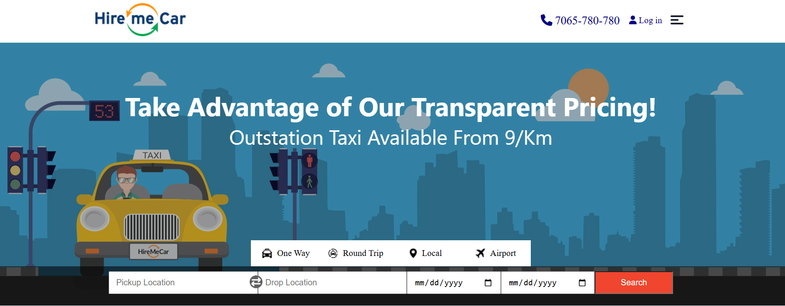
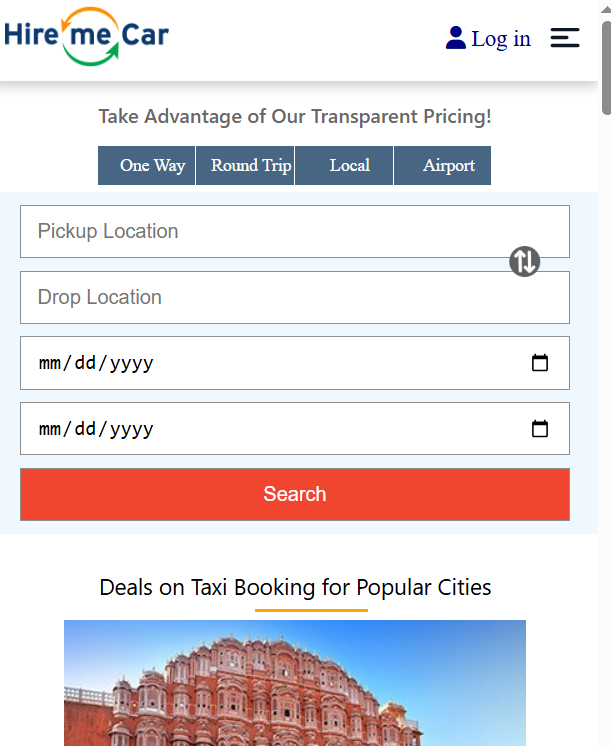

# 🚗 Hire Me Car

A fully responsive Car Rental Website built using HTML, CSS, and JavaScript.

---

## 📌 Project Overview

Hire Me Car is a modern and responsive car rental website designed to provide users with an easy way to explore rental cars online.

---

## 🚀 Technologies Used

* HTML5
* CSS3
* JavaScript

---

## ✨ Features

* Fully Responsive Design
* Modern UI
* Mobile Friendly
* Easy Navigation
* Cross Browser Compatible

---

## 📸 Website Preview

<h3>🏠 Home Section</h3>

<h3>ℹ️ Booking Section</h3>

<h3>📞 Mobile Friendly Section</h3>

---

## 👨‍💻 Author

Sandeep Keshri
